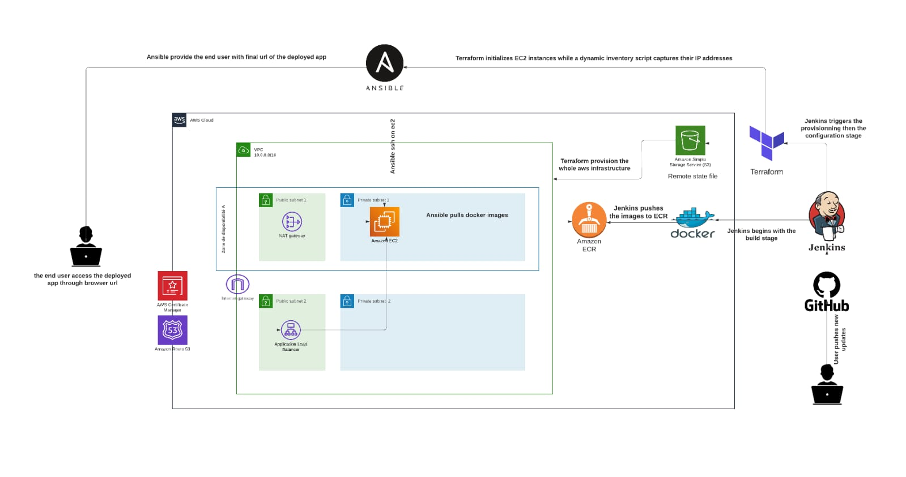

# 🚀 Automated CI/CD Pipeline for Containerized 3-Tier Architecture  

This repository demonstrates the implementation of a fully automated pipeline to deploy a containerized 3-tier application architecture.  

### *Key Features*  
- *Containerization: Built with **Docker* and *Docker Compose* for packaging applications.  
- *Continuous Integration & Deployment: Managed through **Jenkins*.  
- *Infrastructure as Code (IaC): Leveraging **Terraform* for provisioning AWS EC2 instances.  
- *Configuration Management: Automated server setup using **Ansible*.  
- *Cloud Hosting: Deployed on **AWS EC2* instances.  

##  *How It Works*  
1. 🗂️ *Code Source: Jenkins pulls the source code from **GitHub*.  
2. 🛠️ *Build Process*: Docker images are created and pushed to a container registry.  
3. 🚀 *Deployment*: The application is deployed on AWS EC2 instances using Ansible.  
4. 📦 *Infrastructure Setup*: Terraform ensures reproducible, scalable, and reliable infrastructure.  

##  *Technologies Used*  
- *Docker* & *Docker Compose*  
- *Jenkins*  
- *Terraform*  
- *Ansible*  
- *AWS EC2*  
- *GitHub*  

##  *Architecture Diagram*  
  

---
